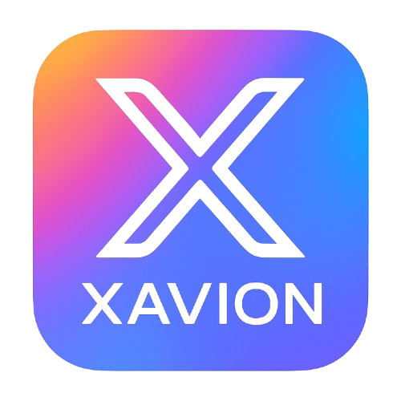

<div align="center"> 
    
   <h1 align="center">Xavion AI</h1> 
    
    
    
    
   <br />
    
    
    
    
</div>
<br /><br />

Xavion AI is a **local-first assistant** that runs entirely on your machine via **Ollama** and **LangChain**. It features streaming responses, intent detection, and easy prompt customization.
<br /><br />

## Latest features
* Switched to **Ollama + LangChain** (via `langchain-ollama`) using the `llama3.1` model by default.
* Centralized prompting with **`instruction` + `knowledge` + `conversation_history`** blocks and **intent detection** helpers.
* Removed the old HuggingFace/GODEL path from the core workflow (you can still adapt the new prompt builder if you want to experiment).

> If you previously followed the HF/GODEL instructions, please switch to **Ollama** and follow the guide below.

## Project Structure
```
Xavion-AI/
├── assets/
│   └── logo.png
├── backend/
│   ├── __init__.py
│   ├── build_prompt.py        # Logic to detect intent and build the prompt for the model
│   ├── build_response.py      # Logic to send the prompt to the model and generate a response
│   ├── chat_workflow.py       # Logic to manage the chat interactions
│   └── key_variables.py       # Auxiliary variables that are stored here and called when necessary
├── main.py
├── requirements.txt
└── README.md
```

## Requirements

1. **Install Python 3.10+**  *(Program has been tested with Python 3.13)*
2. **Install Ollama**

   * macOS: `brew install ollama && ollama serve` or download from [here](https://ollama.com/download/mac)
   * Linux: `curl -fsSL https://ollama.com/install.sh | sh`
   * Windows: download from [here](https://ollama.com/download/windows), then ensure `ollama` is in PATH
3. **Pull a model** (default: `llama3.1`):

   ```bash
   ollama pull llama3.1
   ollama serve  # if not already running as a background service
   ```

## Installation and usage
1. Clone and enter the project.
```bash
git clone https://github.com/javiiervm/Xavion-AI.git
cd Xavion-AI
```

2. Create a virtual environment (use your preferred tool).
```bash
python -m venv .venv
source .venv/bin/activate  # Windows: .venv\Scripts\activate
```

3. Install dependencies.
```bash
pip install -r requirements.txt
```

4. Run the program.
```bash
python main.py
```

## Troubleshooting

* **`ERR: connection refused`** — Ensure `ollama serve` is running.
* **`model not found`** — Run `ollama pull llama3.1` (or switch the name).
* **Windows** — Use `python -m venv .venv` and `.\.venv\Scripts\activate` in PowerShell.

## Resources used

* [Ollama](https://ollama.com)
* [LangChain](https://python.langchain.com)

<br />

Feedback and PRs welcome! Enjoy your new local‑first assistant. 🎧🤖

